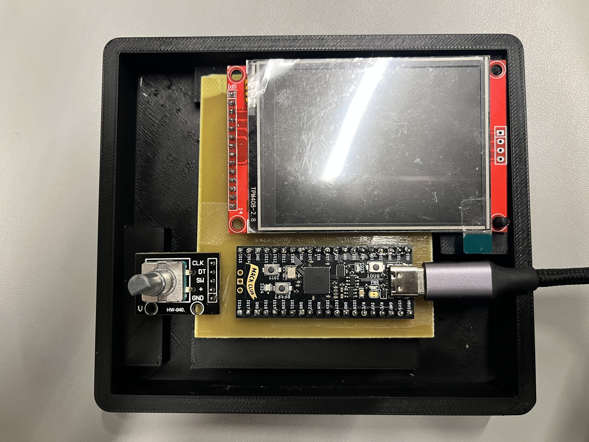
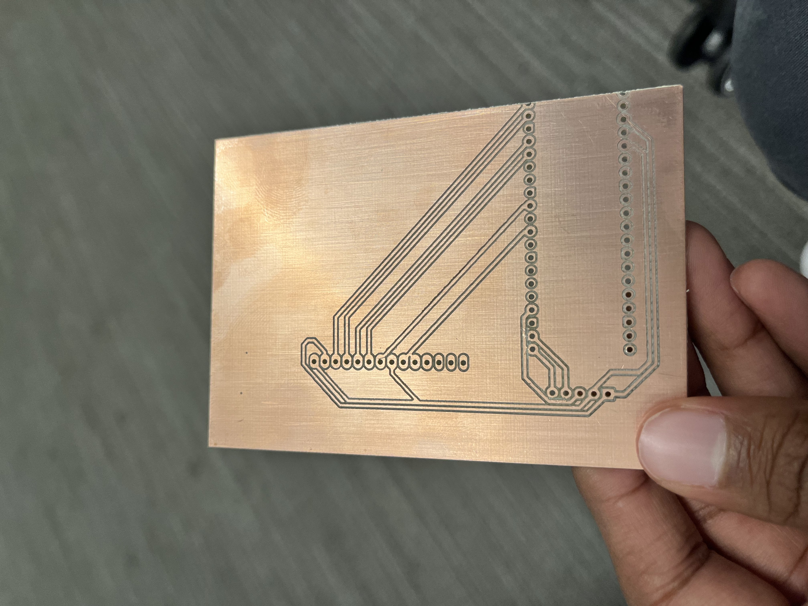
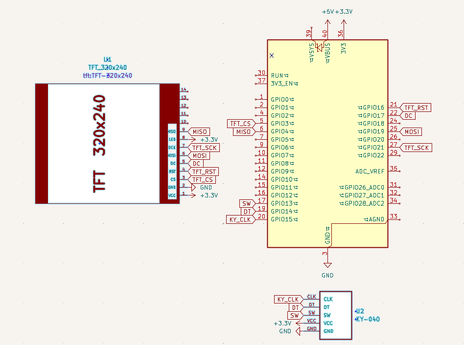

# PizzaPad
The PizzaPad is a small gadget designed to let you make pizza! It has a game that allows you to make your favorite kinds of pizzas and export your orders! You simply use a rotary encoder to cycle through the different toppings, and place them as needed.

The gadget was designed at Hack Club's Undercity Hackathon, held at Github HQ in San Francisco from July 11-14. 

[Here]{https://youtu.be/aZLYuFsbn9c}'s a link to our demo. 

# PCB
We decided that since this was a handheld device, we should try to make it as compact as possible and that'd be best done with a PCB. I designed a PCB in KiCAD within the constraints of the mill at Undercity (1 layer, 0.5 mm minimum trace, 0.5 mm minimum distance between traces, etc.). Here's the design of the milled PCB!

And here's the schematic!

# CAD
Oliver designed a case that would house the PCB, Screen, and Rotary Encoder. It's basically a little smaller than the size of the original 2DS. 

# GAME
The game is quite simple, with players creating their own pizzas and selecting the toppings and amount of toppings they'd like on it. Amounts and types of toppings would be controlled by rotating the encoder, while selecting would be controlled by the encoder's switch. In the end, the goal is to allow the player to export their pizza orders to remember them when they order pizza in real life in the future.

# BOM
- 1x Orpheus Pico
- 1x KY-040 Rotary Encoder Switch
- 1x ILI9341 TFT Screen
- 1x 3D Printed Case with Top and Bottom Housings
- 1x PCB milled by @arp on Slack

